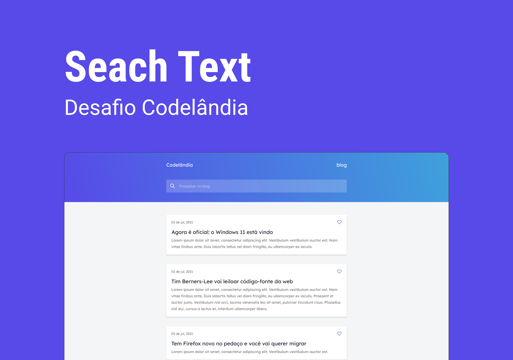

<h1 align="center">
  Desafio - SearchText
</h1>

  

  

  

  

  <a href="#rocket-sobre-o-desafio">Sobre o desafio</a>&nbsp;&nbsp;&nbsp;|&nbsp;&nbsp;&nbsp;
  <a href="#deploy">Deploy</a>&nbsp;&nbsp;&nbsp;|&nbsp;&nbsp;&nbsp;
  <a href="#art-layout">Layout</a>&nbsp;&nbsp;&nbsp;|&nbsp;&nbsp;&nbsp;
  <a href="#memo-licença">Licença</a>

 

## :rocket: Sobre o desafio

Reproduzir layout contendo uma página que simula a busca por títulos de um blog fake

### Funcionalidades da aplicação

- **`Pesquisa relacionada ao texto digitado no input`**

- **`Mostrar quando não tem resultado`**

- **`Habilitar favorito e permanecer salvo em localstorage`**

### Nesse projeto foi utilizado

- **`Vite`**

- **`React JS`**

- **`Zustand e Immer`**

- **`Tailwind CSS`**

 

## :art: Layout

Para acessar o layout do projeto no figma **[clique aqui](https://www.figma.com/file/fZErfmfHuiEIWlVL4Pxz3r/Codel%C3%A2ndia---Desafio-01?type=design&node-id=1%3A292&t=ccrWy0JA6e62diVn-1)**

Layout desenvolvido por [Iuri Code](https://www.instagram.com/iuricode/)

 
## :memo: Licença

Esse projeto está sob a licença MIT. Veja o arquivo [LICENSE](../LICENSE) para mais detalhes.

---

Feito por [Lucas Samuel](https://github.com/lucassamuel94)
